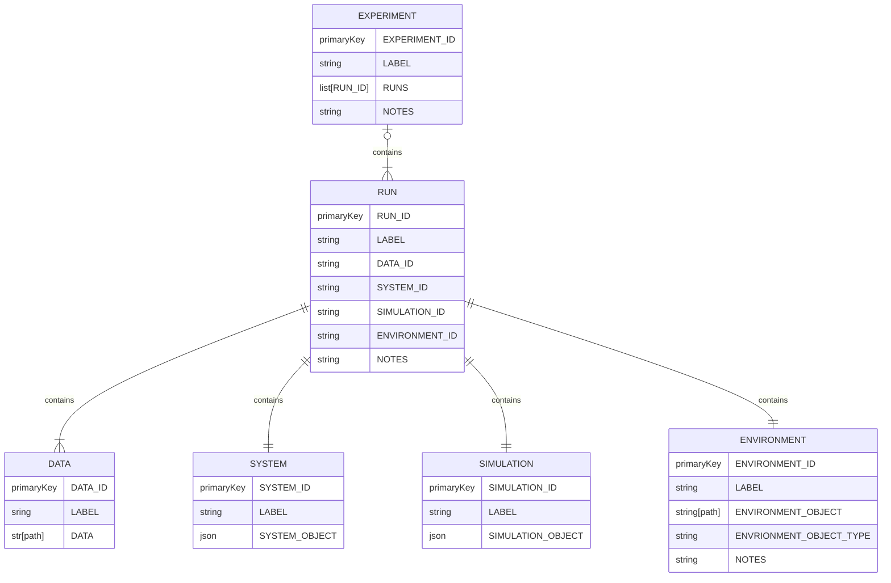

```mermaid
erDiagram
    EXPERIMENT |o--|{ RUN : contains
    EXPERIMENT {
        primaryKey EXPERIMENT_ID
        string LABEL
        list[RUN_ID] RUNS
        string  NOTES
    } 
    RUN {
        primaryKey RUN_ID
        string LABEL
        string DATA_ID
        string SYSTEM_ID
        string SIMULATION_ID
        string ENVIRONMENT_ID
        string NOTES
    }
    RUN ||--|{ DATA : contains
    DATA {
        primaryKey DATA_ID
        sring LABEL
        str[path] DATA
    }
    RUN ||--|| SYSTEM : contains
    SYSTEM {
        primaryKey SYSTEM_ID
        string LABEL
        json SYSTEM_OBJECT
    }
    RUN ||--|| SIMULATION : contains
    SIMULATION {
        primaryKey SIMULATION_ID
        string LABEL
        json SIMULATION_OBJECT
    }
    RUN ||--|| ENVIRONMENT : contains
    ENVIRONMENT {
        primaryKey ENVIRONMENT_ID
        string LABEL
        string[path] ENVIRONMENT_OBJECT
        string ENVRIONMENT_OBJECT_TYPE
        string NOTES
    }
```